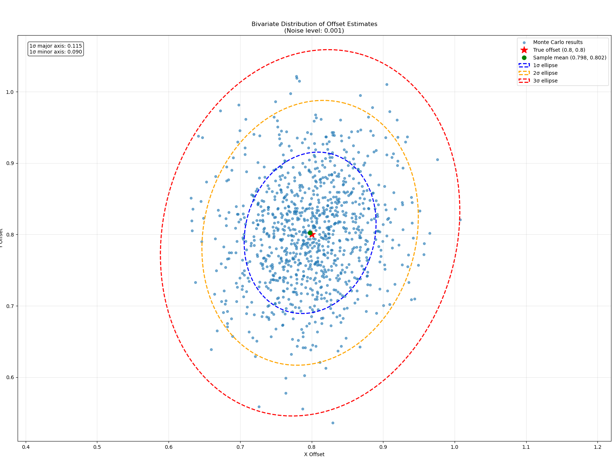
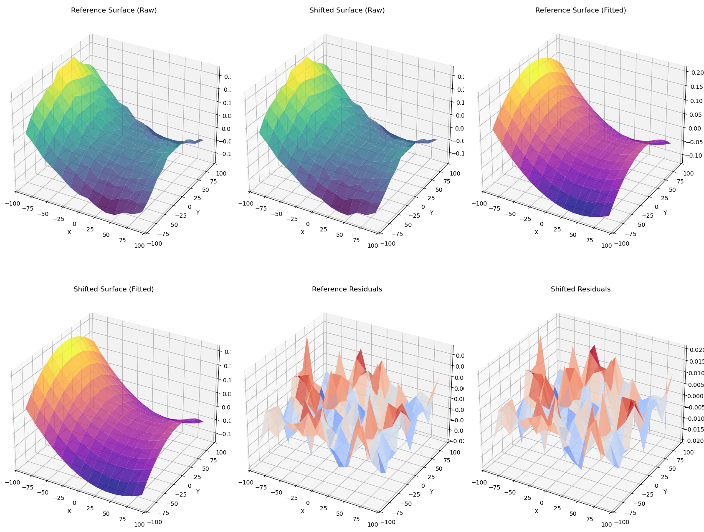

# Dual Extruder/Toolhead Simulations

This is a proof of concept simulation for a technique to align a 3D printer or other machine with two or more toolheads using measurements of the bed.
This assumes both toolheads have a probe, and that the bed mesh can be broadly approximated by a quadratic surface. These assumptions may fail,
rendering this technique useless. For instance, this method would not work if the bed and gantry produce a perfectly flat bed mesh, as the algorithm
would have nothing to align. Fortunately, many hobby 3D printers seem to have a bed mesh that is a bit saddle shaped. The results of a Monte Carlo
simulation of this technique are as follows:

## Algorithmic Approach

Let the reference surface be represented by:

$$f(x, y) = a_{1} \left( x - x_{0} \right)^2 + a_{2}\left( y - y_{0} \right)^2 + a_{3} \left( x - x_{0} \right) \left( y - y_{0} \right) + a_{4} \left( x - x_{0} \right) + a_{5} \left( y - y_{0} \right) + a_{6}$$

Let the offset reference surface be represented by:

$$\hat{f}(x,y) = f\left( x - x_{1}, y - y_{1} \right)$$

Let the samples from the reference surface be $S_{(u, v)}$ and the samples from the offset reference surface be $\hat{S}_{(u, v)}$ such that $(u, v)$ are vertices of a cartesian grid, $G$, within the reference surface.

Minimize $\sum_{(u, v) \in G} \left(S_{(u, v)} - f(u, v)\right)^2 + \sum_{(u, v) \in G} \left(\hat{S}_{(u, v)} - \hat{f}(u, v)\right)^2$ with variables $x_0, x_1, y_0, y_1,$ and $a_i$ for $1<=i<=6$.

The notation is a bit informal here, but we assume the bed mesh can be modeled by some offset quadratic function of six parameters, and attempt to fit the data from a bed mesh for each toolhead
simultaneously to this quadratic as well as the offset between the toolheads. Once this minimization has been completed, we extract $x_1$ and $y_1$ to obtain the
offset.

The following example shows a simulated reference bed mesh, a simulated shifted bed mesh (offset by 0.8mm in each axis), a reference fitted surface, a shifted fitted
surface, and the residuals between each of these:

The difference between the reference and shifted mesh is tiny compared to the size of the mesh, so these graphs look more or less the same.

## Why do this?

I don't like manual calibration, and nozzle probes are quite accurate now. Properly implemented, this would allow for sensorless homing, then toolhead alignment on
IDEX or dual gantry printers.
